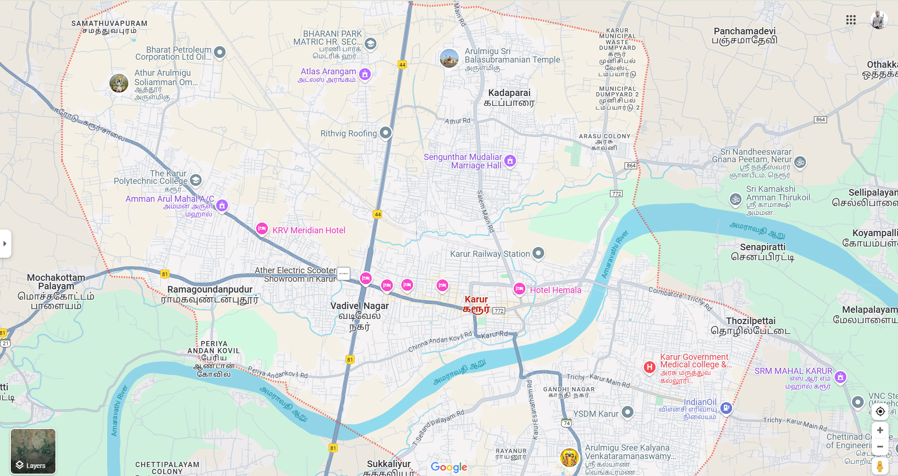
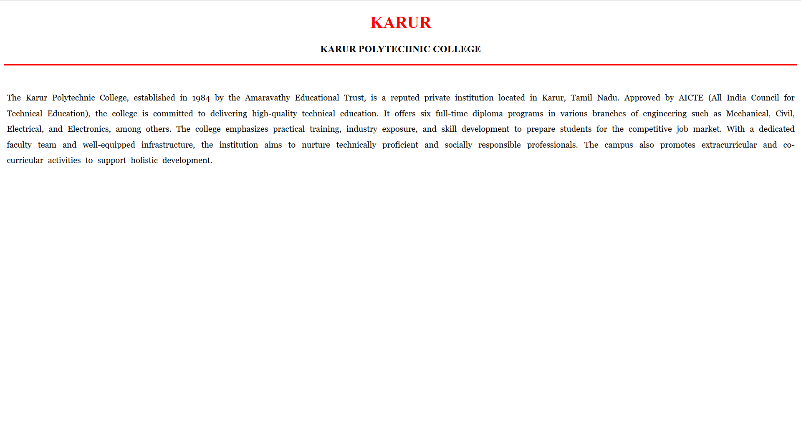
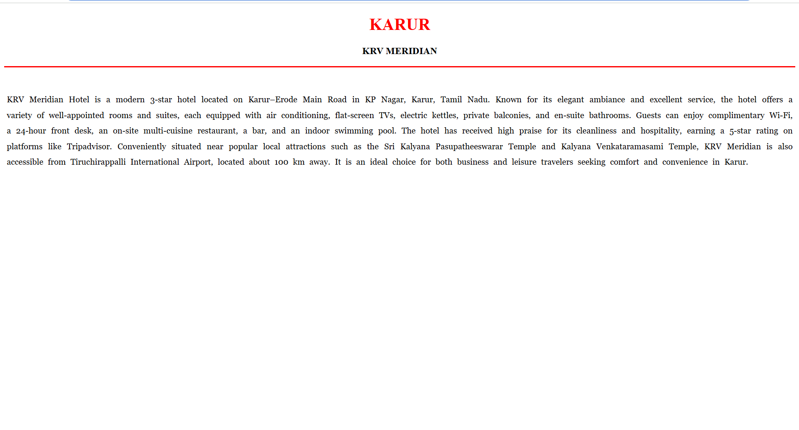
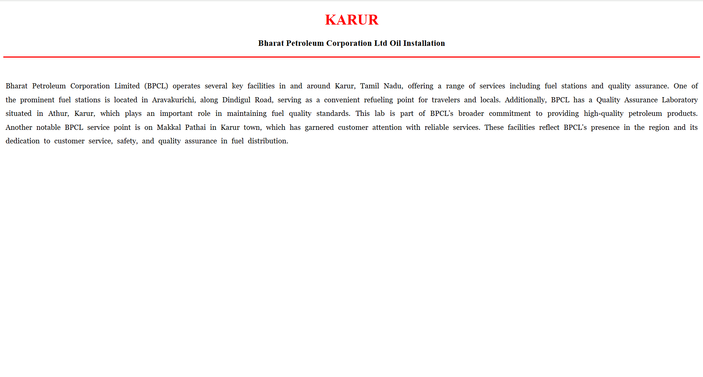
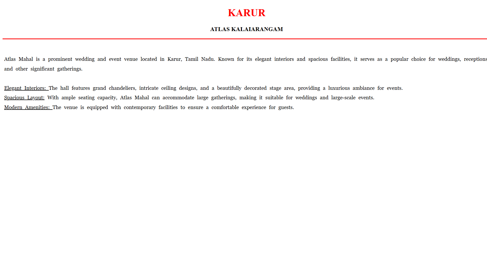
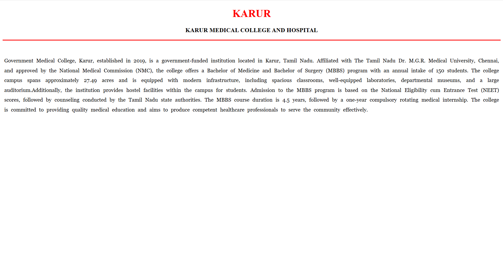

# Ex04 Places Around Me
## Date: 22.04.2025
## Reg No:212224220055

## AIM
To develop a website to display details about the places around my house.

## DESIGN STEPS

### STEP 1
Create a Django admin interface.

### STEP 2
Download your city map from Google.

### STEP 3
Using ```<map>``` tag name the map.

### STEP 4
Create clickable regions in the image using ```<area>``` tag.

### STEP 5
Write HTML programs for all the regions identified.

### STEP 6
Execute the programs and publish them.

## CODE
```
map.html

<!DOCTYPE html>
<html lang="en">
<head>
  <meta charset="UTF-8">
  <title>MY CITY</title>
</head>
<body>
  <h1 align="center"><b>KARUR</b></h1>
  <h3 align="center"><b>MADHESH I (212224220055)</b></h3>
  <center>
  
</center>
  <map name="mymap">
    <area shape="rect" coords="242,354,433,408" href="college.html" alt="Karur Polytechnic College">
    <area shape="rect" coords="541,487,740,493" href="hotel.html" alt="KRV Meridian">
    <area shape="rect" coords="307,93,486,135" href="petroleum.html" alt="Bharat Petroleum Corporation Limited">
    <area shape="rect" coords="632,142,797,184" href="temple.html" alt="Atlas Kalaiarangam">
    <area shape="rect" coords="1363,750,1558,813" href="hospital.html" alt="City Hospital">
  </map>
</body>
</html>


college.html

<!DOCTYPE html>
<html lang="en">
<head>
    <meta charset="UTF-8">
    <meta name="viewport" content="width=device-width, initial-scale=1.0">
    <title>MY AREA</title>
</head>
<body>
    <h1 align="center">
        <font color="red"><b>KARUR</b></font>
    </h1>
    <h3 align="center">
        <b>KARUR POLYTECHNIC COLLEGE</b>
    </h3>
    <hr size="3" color="red">
    <br>
    <p align="justify" style="word-spacing: 5px;padding: 5px;line-height: 30px;">
        <font face="Georgia" size="3">
            The Karur Polytechnic College, established in 1984 by the Amaravathy Educational Trust, is a reputed private institution located in Karur, Tamil Nadu. Approved by AICTE (All India Council for Technical Education), the college is committed to delivering high-quality technical education. It offers six full-time diploma programs in various branches of engineering such as Mechanical, Civil, Electrical, and Electronics, among others.

The college emphasizes practical training, industry exposure, and skill development to prepare students for the competitive job market. With a dedicated faculty team and well-equipped infrastructure, the institution aims to nurture technically proficient and socially responsible professionals. The campus also promotes extracurricular and co-curricular activities to support holistic development.
        </font>
    </p>
</body>
</html>

hotel.html

<!DOCTYPE html>
<html lang="en">
<head>
    <meta charset="UTF-8">
    <meta name="viewport" content="width=device-width, initial-scale=1.0">
    <title>MY AREA</title>
</head>
<body>
    <h1 align="center">
        <font color="red"><b>KARUR</b></font>
    </h1>
    <h3 align="center">
        <b>KRV MERIDIAN</b>
    </h3>
    <hr size="3" color="red">
    <br>
    <p align="justify" style="word-spacing: 5px;padding: 5px;line-height: 30px;">
        <font face="Georgia" size="3">
            KRV Meridian Hotel is a modern 3-star hotel located on Karur–Erode Main Road in KP Nagar, Karur, Tamil Nadu. Known for its elegant ambiance and excellent service, the hotel offers a variety of well-appointed rooms and suites, each equipped with air conditioning, flat-screen TVs, electric kettles, private balconies, and en-suite bathrooms. Guests can enjoy complimentary Wi-Fi, a 24-hour front desk, an on-site multi-cuisine restaurant, a bar, and an indoor swimming pool. The hotel has received high praise for its cleanliness and hospitality, earning a 5-star rating on platforms like Tripadvisor. Conveniently situated near popular local attractions such as the Sri Kalyana Pasupatheeswarar Temple and Kalyana Venkataramasami Temple, KRV Meridian is also accessible from Tiruchirappalli International Airport, located about 100 km away. It is an ideal choice for both business and leisure travelers seeking comfort and convenience in Karur.
                  </font>
    </p>
</body>
</html>

petroleum.html

<!DOCTYPE html>
<html lang="en">
<head>
    <meta charset="UTF-8">
    <meta name="viewport" content="width=device-width, initial-scale=1.0">
    <title>MY AREA</title>
</head>
<body>
    <h1 align="center">
        <font color="red"><b>KARUR</b></font>
    </h1>
    <h3 align="center">
        <b>Bharat Petroleum Corporation Ltd Oil Installation</b>
    </h3>
    <hr size="3" color="red">
    <br>
    <p align="justify" style="word-spacing: 5px;padding: 5px;line-height: 30px;">
        <font face="Georgia" size="3">
            Bharat Petroleum Corporation Limited (BPCL) operates several key facilities in and around Karur, Tamil Nadu, offering a range of services including fuel stations and quality assurance. One of the prominent fuel stations is located in Aravakurichi, along Dindigul Road, serving as a convenient refueling point for travelers and locals. Additionally, BPCL has a Quality Assurance Laboratory situated in Athur, Karur, which plays an important role in maintaining fuel quality standards. This lab is part of BPCL’s broader commitment to providing high-quality petroleum products. Another notable BPCL service point is on Makkal Pathai in Karur town, which has garnered customer attention with reliable services. These facilities reflect BPCL's presence in the region and its dedication to customer service, safety, and quality assurance in fuel distribution.
        </font>
    </p>
</body>
</html>

temple.html

<!DOCTYPE html>
<html lang="en">
<head>
    <meta charset="UTF-8">
    <meta name="viewport" content="width=device-width, initial-scale=1.0">
    <title>MY AREA</title>
</head>
<body>
    <h1 align="center">
        <font color="red"><b>KARUR</b></font>
    </h1>
    <h3 align="center">
        <b>ATLAS KALAIARANGAM</b>
    </h3>
    <hr size="3" color="red">
    <br>
    <p align="justify" style="word-spacing: 5px;padding: 5px;line-height: 30px;">
        <font face="Georgia" size="3">
            Atlas Mahal is a prominent wedding and event venue located in Karur, Tamil Nadu. Known for its elegant interiors and spacious facilities, it serves as a popular choice for weddings, receptions, and other significant gatherings.<br><br>
            <u>Elegant Interiors: </u>The hall features grand chandeliers, intricate ceiling designs, and a beautifully decorated stage area, providing a luxurious ambiance for events.​<br>

<u>Spacious Layout:</u> With ample seating capacity, Atlas Mahal can accommodate large gatherings, making it suitable for weddings and large-scale events.<br>​

<u>Modern Amenities: </u>The venue is equipped with contemporary facilities to ensure a comfortable experience for guests.<br>
        </font>
    </p>
</body>
</html>

hospital.html

<!DOCTYPE html>
<html lang="en">
<head>
    <meta charset="UTF-8">
    <meta name="viewport" content="width=device-width, initial-scale=1.0">
    <title>MY AREA</title>
</head>
<body>
    <h1 align="center">
        <font color="red"><b>KARUR</b></font>
    </h1>
    <h3 align="center">
        <b>KARUR MEDICAL COLLEGE AND HOSPITAL</b>
    </h3>
    <hr size="3" color="red">
    <br>
    <p align="justify" style="word-spacing: 5px;padding: 5px;line-height: 30px;">
        <font face="Georgia" size="3">
            Government Medical College, Karur, established in 2019, is a government-funded institution located in Karur, Tamil Nadu. Affiliated with The Tamil Nadu Dr. M.G.R. Medical University, Chennai, and approved by the National Medical Commission (NMC), the college offers a Bachelor of Medicine and Bachelor of Surgery (MBBS) program with an annual intake of 150 students.

            The college campus spans approximately 27.49 acres and is equipped with modern infrastructure, including spacious classrooms, well-equipped laboratories, departmental museums, and a large auditorium.Additionally, the institution provides hostel facilities within the campus for students.
            
            Admission to the MBBS program is based on the National Eligibility cum Entrance Test (NEET) scores, followed by counseling conducted by the Tamil Nadu state authorities. The MBBS course duration is 4.5 years, followed by a one-year compulsory rotating medical internship.
            
            The college is committed to providing quality medical education and aims to produce competent healthcare professionals to serve the community effectively.
        </font>
    </p>
</body>
</html>
```

## OUTPUT






## RESULT
The program for implementing image maps using HTML is executed successfully.
